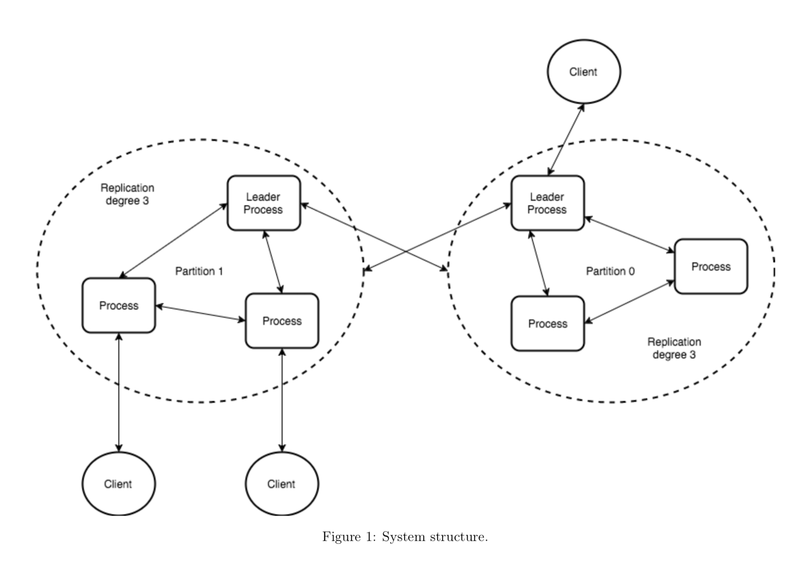
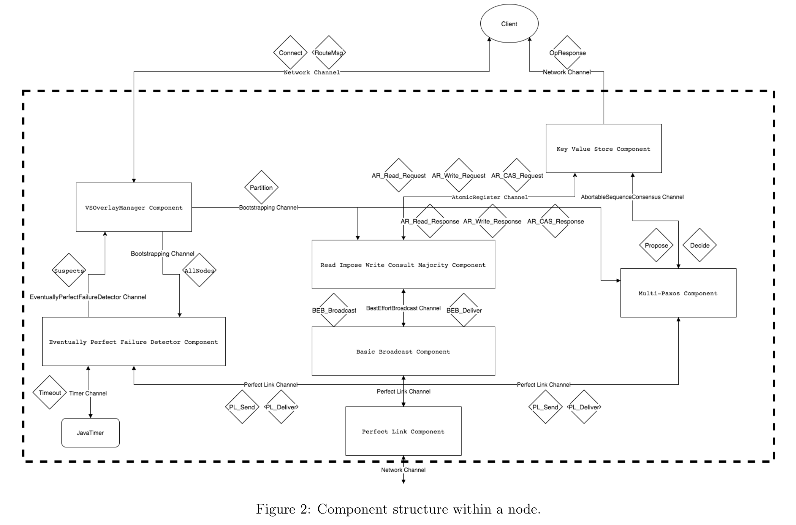

# ID2203 Project

This repository contains code for the implementation of a distributed in memory key-value store and is apart of the final project in the course ID2203 Distributed Systems, Advanced Course. 
The project makes use of Kompics which is a programming model for distributed systems that implements protocols as event-driven components connected by channels

## System Structure
Our system is made up of nodes, a node is essentially a single instance of a server. Each node in the system is assigned a partition. Nodes within a partition are replicated and are responsible for a partition of the key space. Within a partition a leader node proposes an operation to the other nodes using the multi-paxos algorithm, if an operation reaches consensus all participating nodes perform the operation.

A Client is able to connect to any node in the system and start sending commands, a node that is not the designated leader for a partition will forward the request to the partition leader. Nodes receiving messages intended for another partition forward the messages to the leader of the corresponding partition. Figure 1 shows how the system looks like when we have 2 partitions and the replication degree is set to δ = 3.



Each node is composed of various components with unique responsibilities. Each component is connected via ports and channels which transmit messages between the components and the outside world. These messages trigger event handlers who process the messages. Figure 2 depicts the inner structure of a single node in our system and how the components are connected.



## Implementation
The following section explains and describes our implementation of the distributed key value store.

### Perfect Link
Many of the algorithms we implemented use a perfect link abstraction. The perfect link component has two responsibilities, to listen for PL_Send messages on the Perfect Link channel, convert the payload into a Message object before handing the message over to the network for transport and listening in on the network for PL_Deliver messages. Upon receiving PL_Deliver message the component extracts the content and sends it to the Perfect Link channel.

Properties of perfect links:
* Reliable Delivery: If pi and pj are correct, then every message sent by pi to pj is
eventually delivered by pj
* No duplication: Every message is delivered at most once
* No creation: No message is delivered unless it was sent

### Basic Broadcast

The Basic Broadcast component implements a best effort broadcast algorithm. The component maintains a set of all nodes within a partition to be able to broadcast a message it receives from the component above to all nodes within a partition.

The component is composed of three event handlers. The initHandler listens for par- tition messages on the Bootstrapping channel which contains a view of the partition and alive nodes. The bebBroadcastHandler listens for broadcast messages on the Best Effort Broadcast channel, then for each node in the topology it creates a new PL_Send message and sends it to the Perfect Link Channel. The plDeliverHandler listens for PL_Deliver messages on the Perfect Link channel and creates a BEB_Deliver message from the pay- load of the received message and sends it to the Best Effort Broadcast channel.

Best-Effort Broadcast should satisfy the following properties:
* Validity: If a correct process broadcasts a message m, then every correct process eventually delivers m.
* No duplication: No message is delivered more than once.
* No creation: If a process delivers a message m with sender s, then m was previously broadcast by process s.

### Eventual Perfect Failure Detector Component
Our eventually perfect failure detector starts running after bootstrapping has finished. Each node has a built in eventually perfect failure detector component with a view of all nodes in the system. The heartbeat request/reply messages start with 5 seconds as timeout and increase the timeout by adding additional 3 seconds. We made a minor modification to the algorithm given to us in the Zeppelin assignments, that is we only work with suspects events and not suspect/restore events to limit the amount of mes- sages sent out. The failure detector component sends out a suspects list to the overlay manager on a timeout event if there is a change from the previous timeout.


Eventually perfect failure detectors defined in a partially synchronous model should sat- isfy the following properties:
* Completeness: Every process that crashes should be eventually suspected perma- nently by every correct process
* Eventual Strong Accuracy: No correct process should be eventually suspected by any other correct process

### Overlay Manager Component
Overlay Manager Component is responsible for routing incoming messages to correct leader nodes and components, it divides nodes into partitions using LookupTable class and the configured replication degree. The replication degree determines how many nodes are replicated within a partition.

After bootstrapping the overlay manager component becomes responsible for giving the failure detector a complete view of the nodes in the system and updating the view of other components for the partition it is in based on suspects messages from the failure detector component.

A very simple leader election is implemented in this component, where routing a message to a particular partition results in a leader being selected from available nodes based on a rank calculated from the IP-address and port number for each node. This is possible through the use of a failure detector notifying the overlay manager of any change in the topology of the system.

### KVstore Component
KVstore component provides simple interface for read, write and cas operations for a distributed key values store. It forwards every request in a proposal message to the multi- paxos component which ensures that all replicated nodes in a partition reach consensus on a sequence of operations to perform on the local HashMap within KVstore component. The component listens for decision events from the multi-paxos component, performs the decided operation and replies to the requesting client.

#### Verifing Linearizability
We have designed various simulation scenarios to verify that the component works as in- tended. Scenarios that check if multiple concurrent operations of the same type give the expected results. A Scenario checking interleaving and concurrent operations and opera- tions in a multi-partitioned system. These scenarios can be found under the "keyvalue" folder in the "test" directory.

### Read Impose Write Consult Majority Component
Our first solution for a replicated distributed key value store was to extend the read impose write consult majority algorithm. The principle idea behind the algorithm is to simulate a shared memory in a distributed setting by implementing registers represent- ing each memory location. The algorithm allows for multiple readers and writers in a fail-noisy model where a process, before writing, reads from majority to get the highest timestamp.

The algorithm provides the following safety properties:
* Sequential Consistency - only allow executions whose results appear as if there is a single system image and “local time” is obeyed
* Linearizability/Atomicity - only allow executions whose results appear as if there is a single system image and “global time” is obeyed

This component uses the Best Effort Broadcast and Perfect Link component described above.

Our extension of the algorithm was to extend requests to include a key to a hash map in the component, the component processes events originating from the KVstore Component and responds with a value that the majority of processes in a replication group have agreed upon.

#### Problems we encountered
After some discussion with our teacher, a problem became apparent with our compare- and-swap functionality using this algorithm, prompting us to change our solution to the multi-paxos algorithm. Because of multiple concurrent writes, it is possible for the value to change while a process is comparing the value from the query phase and before it writes.

### Multi-Paxos
Mutli-Paxos is an extension on the Paxos algorithm where by single value uniform con- sensus is extended to the agreement of a sequences of values. In our case these values correspond to read, write and compare-and-swap operations sent from the client.

Important properties of the algorithm
* Validity - Only proposed values may be decided
* Uniform Agreement - No two processes decide different sequence of values
* Integrity - Each processes can decide a value at most once
* Termination - Every process eventually decides a value

In our solution the multi-paxos component is on a layer below the KVstore component. Listening to proposal events and reaching a uniform consensus on the sequence of the proposal events. The component listens to the Overlay Manager component for updates on the topology of the partition it is in, updating the number of nodes in the partition and to which nodes it is able to send messages to.

#### Problems we encountered
When using the leaderless multi-paxos algorithm we noticed that we were getting a lot of abort messages for simple get requests. The algorithm was working fine and the results were correct but it wasn’t very efficient. We therefore implemented a simple leader election for each partition to select a leader that would be the proposer for incoming requests.

## Testing 
Section contains descriptions on how we verify our solution.

### Best Effort Broadcast
To test the best effort broadcast we wrote two test
* First we broadcast a message to all correct nodes and assert that each node, in- cluding the sender, delivers the message. Verifying no duplication and no creation properties.
* Secondly we crash one sender in the middle of the execution and assert that all cor- rect nodes delivered the same amount of messages. Verifying Best-effort-Validity.

### Eventually Perfect Failure Detector
For eventually perfect failure detector we test the two properties that the failure detector must satisfy
* Strong completeness: Eventually every process that crashes is permanently detected by every correct process
* Eventual strong accuracy: Eventually, no correct process is suspected by any correct process.

We verify this by having two tests. The first one has only correct nodes and verifies that no node is suspected. The second test kills one node and verifies that every correct node detects the failure.

### Key-Value operations
Multiple test scenarios were created to verify that our solution was correct. We imple- mented three tests that assert that running each operation type concurrently confirms to an expected result. A test scenario was created to test interleaving of operation in a sequential and concurrent manner. Lastly a test scenario was made to ensure that our so- lution works as intended in a multi partition system, testing interleaving and concurrent operations.

## Overview

The project is split into 3 sub parts:

- A common library shared between servers and clients, containing mostly messages and similar shared types
- A server library that manages bootstrapping and membership
- A client library with a simple CLI to interact with a cluster of servers

The bootstrapping procedure for the servers, requires one server to be marked as a bootstrap server, which the other servers (bootstrap clients) check in with, before the system starts up. The bootstrap server also assigns initial partitions.

## Getting Started

Clone (your fork of) the repository to your local machine and cd into that folder.

### Building
Build the project with

```
maven clean install
```

### Running

#### Bootstrap Server Node
To run a bootstrap server node `cd` into the `server` directory and execute:

```
java -jar target/project17-server-1.0-SNAPSHOT-shaded.jar -p 45678
```

This will start the bootstrap server on localhost:45678.

#### Normal Server Node
After you started a bootstrap server on `<bsip>:<bsport>`, again from the `server` directory execute:

```
java -jar target/project17-server-1.0-SNAPSHOT-shaded.jar -p 56789 -c <bsip>:<bsport>
```
This will start the bootstrap server on localhost:56789, and ask it to connect to the bootstrap server at `<bsip>:<bsport>`.
Make sure you start every node on a different port if they are all running directly on the local machine.

By default you need 3 nodes (including the bootstrap server), before the system will actually generate a lookup table and allow you to interact with it.
The number can be changed in the configuration file (cf. [Kompics docs](http://kompics.sics.se/current/tutorial/networking/basic/basic.html#cleanup-config-files-classmatchers-and-assembly) for background on Kompics configurations).

#### Clients
To start a client (after the cluster is properly running), `cd` into the `client` directory and execute:

```
java -jar target/project17-client-1.0-SNAPSHOT-shaded.jar -p 56787 -b <bsip>:<bsport>
```

Again, make sure not to double allocate ports on the same machine.

The client will attempt to contact the bootstrap server and give you a small command promt if successful. Type `help` to see the available commands.

